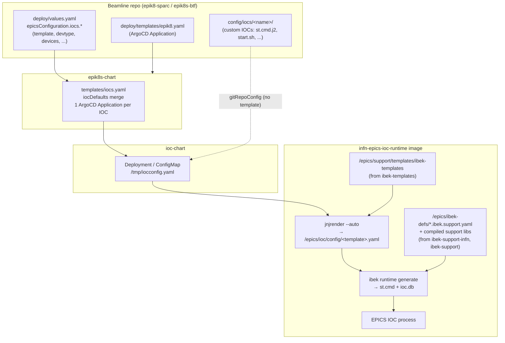

# INFN EPICS IOC: architecture and usage

This document explains how `infn-epics-ioc` and its two INFN submodules,
**ibek-support-infn** and **ibek-templates**, fit together. It also shows how
they are used to deploy IOCs on the SPARC (`epik8-sparc`) and BTF
(`epik8s-btf`) beamlines through the `epik8s-chart` umbrella chart.

## 1. The big picture

Every hardware IOC on SPARC and BTF runs from **one generic container image**,
`ghcr.io/infn-epics/infn-epics-ioc-runtime`. The image already contains every
support module that INFN needs. A short block in the beamline `values.yaml`
turns that generic image into a specific IOC instance. Here is what happens at
deploy time:



In one sentence: **the beamline values pick a template, the template turns
beamline values into an ibek IOC YAML, and ibek turns that YAML into an EPICS
startup script by using the entity models from ibek-support-infn.**

## 2. The repositories

| Repository | Role | Consumed by |
|---|---|---|
| `infn-epics-ioc` (this repo) | Generic IOC: Dockerfiles, `ioc/` app, CI that publishes images to `ghcr.io/infn-epics` | `ioc-chart` (the `image` value) |
| `ibek-support-infn` (submodule) | **Build-time and instance-time** definitions for INFN drivers: how each module is built and which ibek entities it exposes | `Dockerfile` (`ansible.sh <module>`), `ibek` at IOC start |
| `ibek-templates` (submodule) | **Device abstraction**: Jinja2 templates that turn a beamline IOC entry into an ibek `ioc.yaml`; the JSON schemas for beamline and IOC values | `Dockerfile` copies it to `/epics/support/templates/ibek-templates`; `jnjrender` runs it at pod start |
| `ibek-support`, `ibek-support-dls` (submodules) | Upstream epics-containers / DLS support definitions (asyn, motor, ADCore, ...) | `Dockerfile.base` |
| `epics-support-template-infn` (submodule) | Extra INFN templates, copied to `/epics/support/templates/infn-support-templates` | `jnjrender` (same search root) |
| `epik8s-chart` | Umbrella Helm chart: one ArgoCD `Application` per IOC, service, soft IOC, and cron job | Beamline `deploy/templates/epik8.yaml` |
| `ioc-chart` | Per-IOC Helm chart: the pod, ConfigMap, service, and the startup logic that runs `jnjrender` | `epik8s-chart` (`iocs.charturl`) |
| `epik8-sparc`, `epik8s-btf` | Beamline descriptions: `deploy/values*.yaml`, custom IOC configs, OPIs | ArgoCD |

## 3. ibek-support-infn

### 3.1 Layout

There is one folder for each support module. The folder name is the argument
that `ansible.sh` takes.

```
ibek-support-infn/
├── _global/                 # shared ibek definitions + schema
├── ocemPS/
│   ├── ocemPS.install.yml   # how to build the module
│   ├── ocemPS.ibek.support.yaml  # which entities an IOC instance can use
│   └── README.md
├── caenelsPS/  technosoft-tml-motor/  TPG366/  danfysik/  psEEI/  ...
├── schemas/ibek.support.schema.json
├── make_global_schemas.sh
└── tests/test_ioc_generate.sh
```

The repo holds about 40 modules. They cover power supplies (`ocemPS`,
`ocemE642`, `caenelsPS`, `danfysik`, `psEEI`, `maccaferriPS`, `hazemeyer`,
`TTI`, `sigmaPhiStart`, `biltItest`), vacuum (`agilent4uhv`, `agilentipcmini`,
`AgilentXgs600`, `agilent-twistorr-305`, `tpg300_500`, `TPG366`, `midivac`,
`pfeiffer-hiscroll6`), motion (`technosoft`, `technosoft-tml-motor`,
`motorPIGCS2`, `motorMicos`, `thorlabsApt`, `smc`, `PTUControl`, `pi_mercury`),
diagnostics and DAQ (`Tektronix_MSO58LP`, `bergozBcm`, `epics-nds`), timing
(`menlo`), modulators (`ppt-modulator`, `scandinova-*`), I/O (`icpdas`,
`plc-elinp`), and more.

### 3.2 The two files of a module

**`<module>.install.yml`** is read by `ansible.sh` during the image build. It
names the source repo and version, plus the `dbds`, `libs`, and protocol files
to link into the IOC:

```yaml
module: OCEMPowerSupply
organization: https://github.com/infn-epics/
version: main          # prefer a tag for reproducible builds
dbds: [asyn.dbd, modbusSupport.dbd]
libs: [asyn, modbus]
```

**`<module>.ibek.support.yaml`** defines the *entity models* that an IOC
instance may instantiate. Each model has typed parameters with defaults, plus
the `pre_init` / `post_init` startup-script lines and the database templates
that it expands to:

```yaml
module: ocem
entity_models:
  - name: modbusps            # used as  type: ocem.modbusps
    parameters:
      P:   {type: str, description: Device Prefix}
      R:   {type: str, description: Device Suffix}
      IP:  {type: str, default: 127.0.0.1}
      IMAX: {type: int, default: 100}
      ...
    pre_init:
      - value: |
          drvAsynIPPortConfigure("{{R}}_ASYN", "{{IP}}:{{TCPPORT}}", 0,0,0)
          ...
```

### 3.3 How modules get into the image

`Dockerfile` (developer stage) copies the whole submodule and builds the
modules it needs in a **single layer**, to stay under Docker's 127-layer
limit:

```dockerfile
WORKDIR ${SOURCE_FOLDER}/ibek-support-infn
COPY ibek-support-infn/ ./
RUN ansible.sh ocemPS && \
    ansible.sh motorPIGCS2 && \
    ...
```

Modules that are not in this `RUN` line are not compiled into the image, even
when they are present in the submodule. Some are already built into
`infn-epics-ioc-base` (`Dockerfile.base`), and others are commented out. Check
both Dockerfiles when an entity type is "unknown" at IOC start.

After the build, `ibek ioc extract-runtime-assets` copies the compiled
libraries and the `*.ibek.support.yaml` files (into `/epics/ibek-defs/`) to the
slim runtime image.

### 3.4 Adding a new driver

1. Create `ibek-support-infn/<module>/` with `<module>.install.yml` and
   `<module>.ibek.support.yaml` (add the `yaml-language-server` schema header
   for IDE validation).
2. Run `tests/test_ioc_generate.sh` (it builds a combined schema from all
   `*.ibek.support.yaml` files, so it catches broken definitions).
3. Add `ansible.sh <module>` to the `RUN` chain in `Dockerfile` (or to
   `Dockerfile.base` if the module rarely changes).
4. Bump the submodule in `infn-epics-ioc`, then tag a release to publish a new
   image (see §6).
5. Usually you also add an ibek-template (§4.5), so that beamlines never write
   raw ibek entities.

## 4. ibek-templates

### 4.1 Purpose

The ibek entity models are close to the hardware: one entity per port, with
EPICS-style macro names such as `P`, `R`, and `IMAX`. Beamline maintainers
instead describe devices in a **uniform, facility-level vocabulary**: `iocprefix`,
`devices[].name`, `ip`, and a structured `ps:` block. Each template in
`ibek-templates` maps that vocabulary onto one or more ibek entity models.

### 4.2 Layout

Templates are grouped by device group. The directory name (or the
`<name>.yaml.j2` file name) **is** the value of the `template:` field:

```
templates/
├── ps/        caenels  ocem  danfysik  psEEI  hazemeyer  TTI  kima  sigmaphi  iTest  modbus
├── motor/     motor.yaml.j2
├── vac/       agilent  pfeiffer  midivac
├── daq/       adcamera  adcamera2  tektronix  bergoz-bcm  vme
├── io/        icpdas  plceli  modbus-generic  ptu  danfysik_hallprobes
├── cooling/   smc  polyscience
├── modulator/ ppt  scandinova-scandicat-mod  scandinova-mod-k400
├── synch/     menlo  srsDG535
├── mps/       ssrip-mps
└── global/    epik8s-version.db.j2  poi.db.j2  day-accumulator.db.j2  infncam.db
schemas/
├── beamline.schema.json   # validates a beamline deploy/values.yaml
└── ioc.schema.json        # validates one IOC entry (incl. ps:, motor:)
tests/                     # one fixture per template/devtype
ps-schema.yaml, motor-schema.yaml   # human-readable reference for the ps:/motor: blocks
```

### 4.3 The template contract

A template receives **the merged IOC entry** (after `iocDefaults` and the
values that `epik8s-chart` injects) as its Jinja2 context. These are the
variables that templates commonly use:

| Variable | Meaning |
|---|---|
| `iocname` | IOC name (injected by epik8s-chart, lower case) |
| `iocprefix`, `iocroot` | PV prefix; `iocroot` is an optional extra segment |
| `template` | Selects the template directory |
| `devtype` | Selects a branch *inside* the template (e.g. `modbusps`, `modbusps4chan`, `E642`) |
| `devgroup` | Logical group (`mag`, `vac`, `mot`, `diag`, `daq`, ...), used by dashboards and OPI generation |
| `devices[]` | The devices on this IOC (`name`, `ip`/`server`, `port`, device-specific keys) |
| `ps:` | Structured power-supply block (polarity, control mode, current/voltage min/max/ramp/limit); see `ps-schema.yaml` |
| `motor:` | Structured motor block for the TML/technosoft devices |
| `ioc_version` | Image version (used by `global/epik8s-version.db.j2`) |

The output is a regular ibek IOC instance file (`ioc_name`, `entities: [...]`).
Templates follow a consistent override rule: **a device-level key wins over an
IOC-level key, which wins over the template default**, field by field:

```jinja
IMAX: {{ dev_ps.get('current', {}).get('max', ioc_ps.get('current', {}).get('max', 100)) }}
ZERO_TOLERANCE: {{ alim.zero_tolerance | default(zero_tolerance) | default(0.5) }}
```

### 4.4 Global templates

After the main template has rendered, `ioc-chart` renders
`templates/global/` against the same values. If that render produces a
`global.yaml`, the file is appended to every generated IOC YAML. The `.db`
templates in `global/` add PVs that every IOC carries, such as
`<prefix>[:<device>]:EPIK8S:IOC:VERSION` and `...:EPIK8S:IOC:NAME`.

### 4.5 Adding or changing a template

1. Add `templates/<group>/<name>/<name>.yaml.j2`. Branch on `devtype` if one
   template covers several hardware variants.
2. Add the IOC-level fields to `schemas/ioc.schema.json`.
3. Add a fixture `tests/<group>-<name>-test.yaml` with the schema header:
   ```yaml
   # yaml-language-server: $schema=https://raw.githubusercontent.com/infn-epics/ibek-templates/refs/heads/main/schemas/ioc.schema.json
   iocname: "ps-ocem-modbusps-test"
   template: "ocem"
   devtype: modbusps
   devgroup: mag
   iocprefix: "TEST:MAG:OCEM"
   ps: {current: {max: 100}, voltage: {max: 16}}
   devices:
     - {name: "QUATEST01", ip: "192.168.1.8"}
   ```
4. Render it locally, exactly as the pod does:
   ```bash
   pip install jnjrender
   mkdir -p /tmp/out
   jnjrender templates/ tests/ps-ocem-modbusps-test.yaml --auto --output /tmp/out
   cat /tmp/out/ocem.yaml
   ```
5. Validate: `ajv validate -s schemas/ioc.schema.json -d "tests/*.yaml"`.
   CI (`.github/workflows/publish-schemas.yaml`) runs the schema compile, the
   fixture validation, and the render on every push, and creates a release on
   `v*` tags.

Every entity `type:` that a template emits must exist in an
`*.ibek.support.yaml` file **that is built into the image**. Otherwise the
render succeeds, but `ibek runtime generate` fails at IOC start.

## 5. Runtime: what happens inside the IOC pod

The startup script lives in `ioc-chart/templates/deployment.yaml`:

1. The ConfigMap copies the full IOC values to `/tmp/iocconfig.yaml`. If
   `/BUILD_INFO.txt` has a tag, the script rewrites `ioc_version` to match it.
2. **Connectivity check**: the script runs `socat` against `server:port` and
   every `devices[].ip|server:port`. The pod exits on failure unless
   `nocheckconn: true` is set.
3. **Configuration generation**. One of three modes applies:
   - **`template:` set** → `jnjrender /epics/support/templates/ /tmp/iocconfig.yaml --auto --output /epics/ioc/config`.
     `--auto` reads `template:` and searches the whole templates tree (both
     `ibek-templates` and `infn-support-templates`) for a directory with that
     name or for a file `<template>.yaml.j2`, copies it to the config dir, and
     renders every `.j2` file. Then the global templates are applied (§4.4).
   - **`host:` set** → `epik8s-run` builds and runs the IOC natively on a
     remote host over SSH (e.g. Red Pitaya `STEMlab125` IOCs on SPARC).
   - **neither** → the config dir comes from the beamline git repo
     (`gitRepoConfig`, defaulting to `config/iocs/<iocdir|name>`). Any `*.j2`
     file in it is rendered against the IOC values (e.g. `st.cmd.j2`).
4. When an NFS `config` mount exists, the generated config, the `runtime/`
   folder, and a `start.log` are copied to `<mount>/<iocname>/`. This is
   useful for debugging what was actually generated.
5. `ioc/start.sh` (from this repo) runs. When `config/` holds a single
   `*.yaml`, it calls `ibek runtime generate <yaml> /epics/ibek-defs/*.ibek.support.yaml`
   to produce `st.cmd` and `ioc.db`, and then starts the IOC. A `start.sh`
   or `st.cmd` + `ioc.subst` in `config/` takes precedence (see the
   description block at the top of `ioc/start.sh`). RTEMS images use the same
   flow, but the pod acts as a proxy: it places the boot files, reboots the
   crate, and attaches the console.

> **Note:** `start.sh` refuses to start when the config dir contains more than
> one `*.yaml`. A template must therefore produce exactly one YAML file.

## 6. Images and versioning

| Image | Built from | When |
|---|---|---|
| `ghcr.io/infn-epics/infn-epics-ioc-base:<tag>` | `Dockerfile.base` (epics-base + common/upstream support) | `v*` tag or manual dispatch |
| `ghcr.io/infn-epics/infn-epics-ioc-runtime:<tag>` | `Dockerfile` runtime stage | built on every push; pushed (with `:latest`) only on `v*` tags |
| `ghcr.io/infn-epics/infn-epics-ioc-devel:<tag>` | `Dockerfile.devel` (SSH dev image) | built on every push, pushed on tags or manual dispatch |
| `ghcr.io/infn-epics/infn-epics-ioc-rtems-pc686:<tag>` | RTEMS variant (e.g. BTF `dante068`) | `rtems-*` tags on the `rtems-pc686` branch; never overwrites the runtime `:latest` |

The ibek-templates are **baked into the image**. A template change therefore
reaches a beamline only after you complete all of these steps:

1. Commit to `ibek-templates`.
2. Bump the submodule in `infn-epics-ioc` (commits like `update ibek-templates submodule`).
3. Tag `infn-epics-ioc` to publish a new runtime image.
4. Point the beamline at it, through `ioc_version` (global), `image:` (per IOC
   or in `iocDefaults`), or the default `latest` with `imagePullPolicy: Always`.

The schemas are different. Beamline files reference them **by URL from `main`**,
so schema changes take effect in editors immediately.

## 7. epik8s-chart

`epik8s-chart` is the umbrella chart that a beamline deploys. For IOCs, the
relevant file is `templates/iocs.yaml`:

- It loops over `epicsConfiguration.iocs`, which may be a list or a map keyed
  by IOC name. Both beamlines use the map form.
- **`iocDefaults` merge**: when `iocDefaults.<key>` exists, with `<key>` equal
  to the IOC's `template` (or its `devtype` as a fallback), the chart merges
  that map underneath the IOC entry (`mustMergeOverwrite`), so the IOC's own
  values always win. A beamline can therefore define `charturl`, `devgroup`,
  `opi`, `image`, `autosync`, polling defaults, and so on once per device
  family.
- It skips IOCs that have `disable: true`.
- It emits one ArgoCD `Application` named `<beamline>-<ioc>-ioc` that points
  at `ioc-chart` (`charturl`). The full merged IOC entry is passed as Helm
  values, together with these injected values: `beamline`, `iocname`,
  `ioc_version`, `nfsMounts`, a static service IP (`baseIp`/`startIp`) when
  PVA is off or `staticIp` is set, `gitRepoConfig` (for template-less IOCs),
  proxies, secrets, ingress, default resources, and SSH settings for `host:`
  IOCs.
- It adds labels (`devtype`, `devgroup`, `template`, `iochost`) and ArgoCD
  `info` entries (`iocprefix`, `asset`, ...). Dashboards and tooling query
  these.

The same chart also generates services (gateways, archiver, Phoebus, ARGUS,
...), soft IOCs (`softiocs`, `softiocDefaults`), applications, and cron jobs.
`tests/test-values.yaml` is the chart's reference values file.

## 8. Usage in the beamlines

Both beamline repos have the same shape:

```
epik8-sparc/ | epik8s-btf/
├── <beamline>-deploy.yaml     # bootstrap ArgoCD Application → deploy/
├── deploy/
│   ├── Chart.yaml
│   ├── templates/epik8.yaml   # multi-source Application: epik8s-chart + this repo's values
│   └── values*.yaml           # THE beamline description
├── config/iocs/<name>/        # custom/soft IOCs (st.cmd.j2, start.sh, scripts submodules)
├── config/services/ ...
├── opi/                       # Phoebus screens (submodule)
└── dashboard/
```

`deploy/templates/epik8.yaml` uses ArgoCD **multi-source**: it renders
`github.com/infn-epics/epik8s-chart` at `targetRevision`, using value files
taken from the beamline repo through `ref: beamline`:

| Beamline | Value files |
|---|---|
| SPARC | `deploy/values.yaml`, `deploy/values-softiocs.yaml` |
| BTF | `deploy/values.yaml`, `deploy/values-linac.yaml`, `deploy/values-accumulator.yaml` |

Both `values.yaml` files start with
`# yaml-language-server: $schema=.../ibek-templates/.../schemas/beamline.schema.json`.
The schema maintained in ibek-templates therefore validates the beamline
descriptions as you edit them.

### 8.1 SPARC (`epik8-sparc`)

SPARC is the largest consumer. It defines about 140 IOCs, most of them driven
by ibek-templates: `motor`, `adcamera`, `agilent-vac`, `pfeiffer-tpg`,
`hazemeyer`, `icpdas`, `caenels`, `ocem`, `tektronix`, `ppt`, `TTI`, `smc`,
`midivac`, `scandinova-mod-k400`, `bergoz-bcm`, and others. The remaining IOCs
use template-less configs in `config/iocs/` (e.g. `mrf` with `st.cmd.j2`, and
Python soft IOCs such as `klyloop`, `lasersynch`, and `collector` pulled in as
git submodules), or `host:` IOCs (`STEMlab125`, `libera-*`).

`iocDefaults` sets per-family defaults, including image pins. For example,
`adcamera` sets `image: ghcr.io/infn-epics/infn-epics-ioc-runtime:v26.1.30b1`
and enables an HTTP stream service.

Example: an OCEM 4-channel crate (template `ps/ocem`, branch `modbusps4chan`):

```yaml
epicsConfiguration:
  iocs:
    ocem-modbus4chan0:
      name: ocem-modbus4chan0
      template: ocem
      devtype: modbusps4chan
      devgroup: mag
      iocprefix: SPARC:MAG:OCEM
      cratename: CRATE5
      ip: 192.168.0.5
      opi: ocem/OCEM_modbus4chan.bob
      ps:
        current: {max: 30}
        voltage: {max: 15}
      devices:            # positional: WAYA..WAYD; empty name = unused way
        - name: ""
        - name: ""
        - name: PTLVCR01
        - name: PTLHCR01
```

At pod start, `ocem.yaml.j2` turns this into one `ocem.modbusps4chan` entity
for the crate, plus `DbAlias` records that map
`SPARC:MAG:OCEM:CRATE5:WAYC:*` to `SPARC:MAG:OCEM:PTLVCR01:*`.

SPARC CI (`.gitlab-ci.yml`) runs `epik8s-opigen --yaml deploy/values.yaml` from
`epik8s-tools` to generate test OPIs from the same values, so `devgroup`,
`devtype`, and `opi` matter beyond the IOC itself.

### 8.2 BTF (`epik8s-btf`)

BTF is smaller (about 30 IOCs). It combines templated IOCs with soft IOCs that
wrap the DAFNE control system (`mag-wrapper`, `unimag`, `mem2epics`). Its
`iocDefaults` show the pattern clearly:

```yaml
iocDefaults:
  motor:   {template: motor, devtype: technosoft-asyn, devgroup: mot, opi: "motor-asyn/Motor_Main.bob", ...}
  ocem:    {devtype: E642, devgroup: mag, opi: "ocem/OCEM_unimag_v2.bob", idle_poll_s: 0.2, active_poll_s: 0.1, ...}
  adcamera: {devtype: camera, devgroup: cam, pva: true, enable_ingress: true, ...}
  danfysik: {devtype: sys8x00, devgroup: mag, ...}
  maccaferriPS: {devtype: maccaferri, ...}
  psEEI:   {devtype: eei, ...}
```

An IOC entry then needs only `template:` plus the device-specific fields.
BTF also hosts the **RTEMS VME** IOC `dante068` (a VMIVME-7750 in the DAFNE
crate). It uses `template: vme` (`templates/daq/vme/vme.yaml.j2`) and the
`infn-epics-ioc-rtems-pc686` image:

```yaml
dante068:
  name: dante068
  iocprefix: DANTE068
  image: ghcr.io/infn-epics/infn-epics-ioc-rtems-pc686:rtems-v0.1.1
  template: vme
  devgroup: daq
  devtype: vme
  devices:
    - {name: QDC0, type: caen-qdc, card_type: V965, address: "0xee000000", vector: 160, level: 5}
    - {name: SIS0, type: sis3820, address: "0x38000000", vector: 224, level: 6, max_chans: 2048}
```

## 9. Common tasks

**Add a device of an existing type to a beamline.** Add an entry under
`epicsConfiguration.iocs` in the beamline `values.yaml`, with the right
`template` and `devtype` and the `devices`. Copy a matching fixture from
`ibek-templates/tests/` as a starting point. Your editor validates the entry
against the schema. Commit, then sync the IOC application in ArgoCD (most IOCs
have `autosync: false`).

**Support a new hardware type.** Work through these steps in order:
1. Add the driver to `ibek-support-infn` (§3.4).
2. Add a template, its schema entry, and a fixture to `ibek-templates` (§4.5).
3. Bump both submodules in `infn-epics-ioc`.
4. Tag a release to get a new runtime image.
5. Optionally add an `iocDefaults.<template>` block to the beamline.
6. Add the IOC entries.

**Debug a failing IOC.** Check these in order:
1. The pod log prints the full `/tmp/iocconfig.yaml` and the jnjrender output.
2. On the NFS config mount, `<iocname>/` holds the rendered YAML and `start.log`
   (image tag, template, devtype).
3. "Template directory ... not found" (exit 7) means that the `template:` value
   matches no directory or `.yaml.j2` file in the image's templates. The image
   is probably older than the template.
4. An ibek error about an unknown entity type means that the support module is
   not in the image's `ansible.sh` list.
5. A connection-check failure means that the device is unreachable. Set
   `nocheckconn: true` to bypass the check.

**Reproduce the render offline.** Take the IOC block from `values.yaml` and add
`iocname:` (normally injected by the chart). Then run `jnjrender templates/
<file> --auto --output <dir>` from `ibek-templates` (§4.5).
